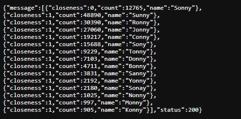

# Name Spellchecker

Name Spellchecker is a small flask script intended to help determine how to spell a first or last name when speaking to someone likely over the phone. It's made using SymSpell. By using a name's popularity you can hopefully determine if the name you have taken is correct or very close to correct. 

E.g input Hrown -> output Brown as it is a very popular last name with only 1 step/mistake away.

# Example
Using my first name 

Hosted at https://kernocal.eu.pythonanywhere.com/search it sometimes goes offline but you never know!

# Usage
The flask server has one endpoint called search that needs 2 parameters, name and type. name should be a string using the alphabet note that it is case sensitive. type is either first last or both.

The output is JSON {"status": status, "message": data}
status is HTTP response status codes.
data is an array of results, ordered by closeness then count.
each result is of the form {closeness: non negative int, count: int, name: string}

data can also be a string, if there's an error.
